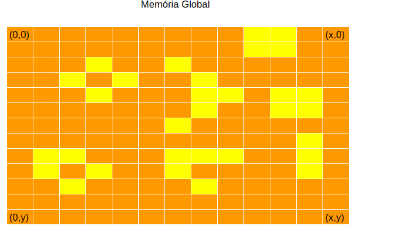
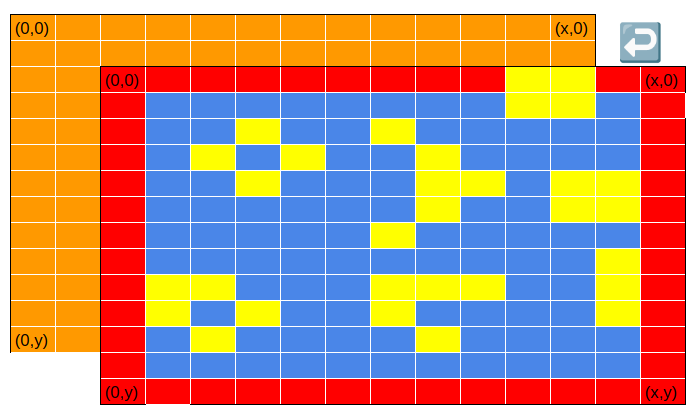
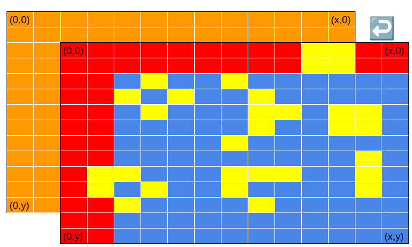
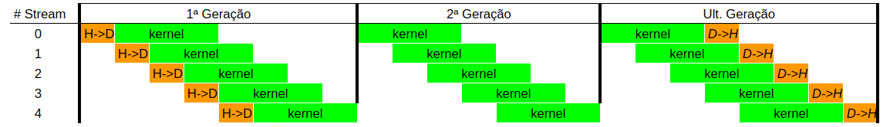

# IMPLEMENTAÇÃO - Game of Life
Para este projeto, temos a resolução do problema Game of Life voltado com offload em GPU. Os seus casos de uso estão voltados com a aplicação direta de paralelismo pela GPU.

## Explicação do Problema
O jogo da Vida é um jogo autômato que  segue um padrao de vida que, por meio de regras simples, as alterações e mudanças em grupos de seres vivos. As regras são bem claras: 
- Qualquer célula viva com menos de dois vizinhos vivos morre de solidão.
- Qualquer célula viva com mais de três vizinhos vivos morre de superpopulação.
- Qualquer célula com exatamente três vizinhos vivos se torna uma célula viva.
- Qualquer célula com dois vizinhos vivos continua no mesmo estado para a próxima geração.
Por meio de um recorte inicial, temos um padrao do funcionamento do jogo:

```cpp
//Calculo Inicial
if(n < 2 || n > 3)
new_univ[y][x] = 0;
if(n == 3)
new_univ[y][x] = 1;
if(n == 2)
new_univ[y][x] = univ[y][x];
```

Para tornar as coisas mais interessantes, tornamos as bordas do jogo infinita. Isso torna os calculos maiores e melhor sincronização de dados para serem acessados.

## 1. Implementação Inicial com Uso de openMP
Por conta do massivo paralelismo que temos para este problema, é possivel fazer o uso das instruções de openMP que permitem não só a natureza de paralelismo do problema, mas também a possibilidade de vetorização.
```cpp
#pragma omp parallel shared(univ, new_univ) private(x,y)
for_yx {
    u_char n = univ[(y-1+h)%h][(x-1+w)%w] + univ[(y-1+h)%h][(x  +w)%w] + univ[(y-1+h)%h][(x+1+w)%w] +
               univ[(y  +h)%h][(x-1+w)%w] +                              univ[(y  +h)%h][(x+1+w)%w] +
               univ[(y+1+h)%h][(x-1+w)%w] + univ[(y+1+h)%h][(x  +w)%w] + univ[(y+1+h)%h][(x+1+w)%w]; 
    if(n < 2 || n > 3)
        new_univ[y][x] = 0;
    if(n == 3)
        new_univ[y][x] = 1;
    if(n == 2)
        new_univ[y][x] = univ[y][x];
```

## 2. Implementação CUDA v0.0
Essa implementação leva em conta a transição de dados de maneira síncrona para a GPU por meio do uso das diretivas `cudaMemcpy` e `cudaMalloc` que permite o uso da GPU NVIDIA.
Além disso, para reduzir os cálculos realizados na GPU, temos uma modificação (em tempo de compilação) da função de cálculo de vizinhos, como pode ser visto abaixo:

```cpp
// Check if (Width x Height) is multiple at comp. time
constexpr bool isPowerOfTwo(const int number){
    return (number > 0) && ((number - 1) & number) == 0;
int matrix_idx(int x, int y)
{
    // Better for GPU and require less operations
    if constexpr (isPowerOfTwo(Width) && isPowerOfTwo(Height))
    return (x + Width) & (Width - 1) + (y + Height) & (Height - 1) * Width;
    
    // if is not power of two - general case
    return (((x + Width) % Width) + ((y + Height) % Height) * Width);
}
```
## 3. Implementação CUDA v1.0
P/ esta versão, fizemos o teste do uso de memória Local. Na imagem abaixo, podemos interpretar como foi a metodologia usada para acesso a memoria partilhada por grid:
Na primeira imagem, temos como é o dado localizado na memoria global.  Mas, como temos que levar em consideração as celulas vizinhas para calcular o ladrilho desejado. Com isso, temos a necessidade de transferir 2 linhas e colunas a mais para corretude do algoritmo. 

Memória Global:<br>


Ideia de Memoria Local:<br>


Memoria Local Implementada:<br>

A linha vermelha é demonstrada como borda(e as condições apresentadas para serem executadas) para envio dos dados para memória Local.

```cpp
//Invocação de shared Mem.
__shared__ int SharedMemory[BLOCK+2][BLOCK+2]
    //Copia do acesso do ladrilho
    // Linha Lateral
    if (tx == 0) {
        SharedMemory[ty + 1][0] = Universe[matrix_idx(gy + 1, gx)];
        SharedMemory[ty + 2][0] = Universe[matrix_idx(gy + 2, gx)];
    }
    // Linha Superior
    if (ty == 0) {
        SharedMemory[0][tx + 1] = Universe[matrix_idx(gy, gx + 1)];
        SharedMemory[0][tx + 2] = Universe[matrix_idx(gy, gx + 2)];
    }
    // Topo superior
    if (ty == 0 && tx == 0) {
        SharedMemory[0][0]       = Universe[matrix_idx(gy    , gx    )];
        SharedMemory[1][0]       = Universe[matrix_idx(gy + 1, gx    )];
        SharedMemory[0][1]       = Universe[matrix_idx(gy    , gx + 1)];
        SharedMemory[1][1]       = Universe[matrix_idx(gy + 1, gx + 1)];
        SharedMemory[ty+2][tx+2] = Universe[idx_matrix(gy + 2, gx + 2)];
    }
    (.....)

```

## 4. Implementação CUDA v2.0
Esse caso leva em conta se tivermos um Game Of Life suficientemente Grande (Universe Of Life?). 
Esse caso fazemos uso de streams que realizam de maneira assíncrona a emissão de kernels. Isso permite menor tempo na execução de Universos suficientemente grandes para execução. 

* OBS 1.0: O cudaMalloc tem uma representação suficientemente grande por ser a primeira chamada de GPU que leva a um overhead o inicio da programação.
* OBS 2.0: Apesar de Generalizado, é necessario sincronizar cada stream ao final de cada Geração(possivel futura implementação).


## Ref. Bibliograficas

- [Wiki Game of  Life](https://conwaylife.com/wiki/)
- [FPGA Implementation - hrvach](https://github.com/hrvach/Life_MiSTer)
